# TPDI Futo Keyboard: added features

Every feature below is behind its own toggle, off by default (layout keys are opt-in), so with all of them off the keyboard behaves like the Play Store build. In the combined build the toggles are also collected on Settings > TPDI Features.

## Layouts

### KASROZ (arrows)

The KASROZ layout, modified by TP Diffenbach with numerous hints: almost every key carries a symbol or punctuation mark on long press (the small grey characters), the number row sits on top, the right-hand space key is a microphone key, and an arrow-key row with undo and redo sits under the space bar. Load it with the custom layout editor (Developer > Custom layouts > Load from file; turn on Settings > TPDI Features > Load layout from file first).

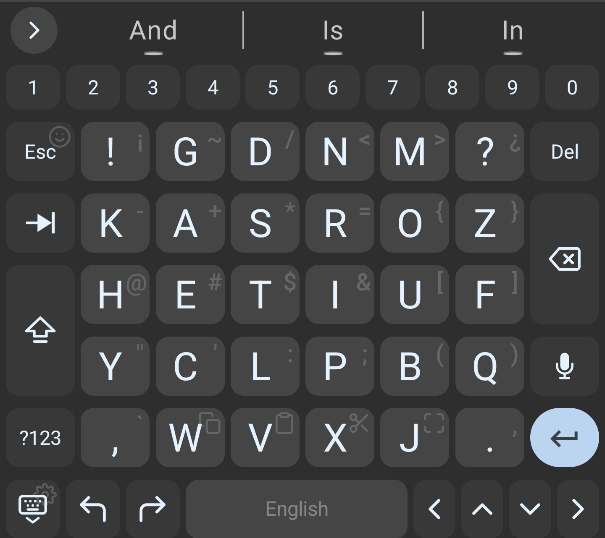

Layout file: [docs/kasroz-arrows.yaml](docs/kasroz-arrows.yaml). Also docs/kasroz-arrows-multilingual.yaml (KASROZ with an added short arrow-key row at the very bottom).

### Standard 84-key layout

An 84-key style keyboard (a 75% layout with the navigation column on the right): a function-key row on top (Esc, F1 to F12, NmLk, ScrLk, Del), then the number row, the letters with Tab, Caps, Ctrl, Alt, Win and Fn keys, and Home, Page Up, Page Down and End in a column on the right. Wide keys are shortened to fit. Ctrl, Alt, Win, AltGr, Fn, Caps and NmLk/ScrLk are the sticky modifier keys below (tap to latch, long press to lock), so Ctrl+C works from the soft keyboard. Turn on Sticky modifier keys and Send key codes rather than text.

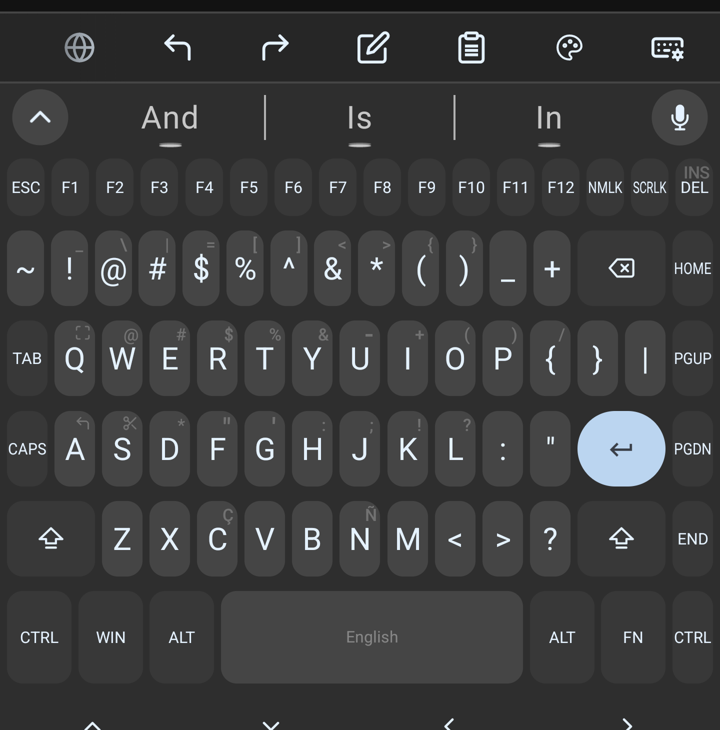

Layout file: [docs/standard-84-key-layout.yaml](docs/standard-84-key-layout.yaml).

## Key hints

### Key hint size

A slider scales the small hint characters (the long-press symbols) printed on keys, as a percent of the theme's size.

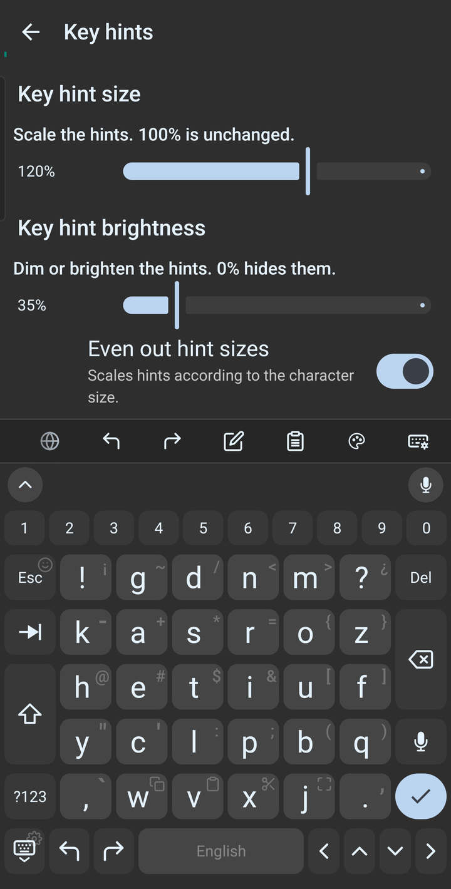

Toggle: Settings > Typing > Key hints. Issue [#1](https://github.com/tpdi/tpdi-android-keyboard/issues/1), PR [#73](https://github.com/tpdi/tpdi-android-keyboard/pull/73).

### Key hint brightness

A slider dims or brightens the hint characters, 0% to 100%.

Toggle: Settings > Typing > Key hints. Issue [#2](https://github.com/tpdi/tpdi-android-keyboard/issues/2), PR [#74](https://github.com/tpdi/tpdi-android-keyboard/pull/74).

### Even out hint sizes

Dashes, quotes and commas are tiny next to braces and slashes. This scales the small glyphs up (never down) so hints read at a similar size, keeping each glyph's centre line.

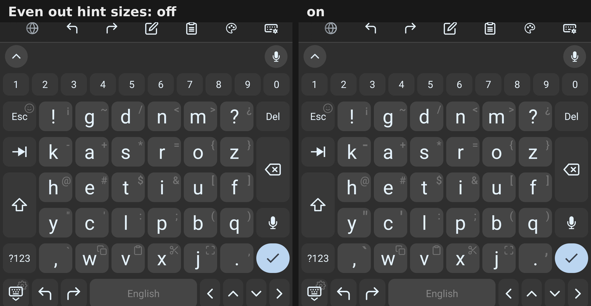

Toggle: Settings > Typing > Key hints. Issue [#3](https://github.com/tpdi/tpdi-android-keyboard/issues/3), PR [#76](https://github.com/tpdi/tpdi-android-keyboard/pull/76).

### Key hints page with a live preview

Size, brightness and evening-out sit together under a live keyboard preview, so you see the change as you drag.

Toggle: Settings > Typing > Key hints. Issue [#36](https://github.com/tpdi/tpdi-android-keyboard/issues/36), PR [#75](https://github.com/tpdi/tpdi-android-keyboard/pull/75).

## Typing and layouts

### Sticky modifier keys

Ctrl, Alt, Meta, AltGr, Fn, Sym, Shift and lock keys for custom layouts. Tap to latch for the next key (sent as a real key event, so Ctrl+C and Alt+Tab work); long press to lock. A latched key is drawn pressed. Includes an 84-key layout (docs/standard-84-key-layout.yaml).

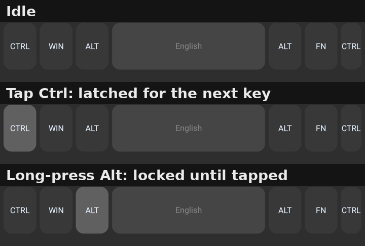

Toggle: Settings > TPDI Features > Sticky modifier keys (Settings > Typing in the feature PR). Issue [#25](https://github.com/tpdi/tpdi-android-keyboard/issues/25), PR [#56](https://github.com/tpdi/tpdi-android-keyboard/pull/56).

### Send key codes rather than text

Tab, Enter, Escape, Home, End, Page Up/Down, Forward Delete, Insert and F1 to F12 as real key events, like a hardware keyboard.

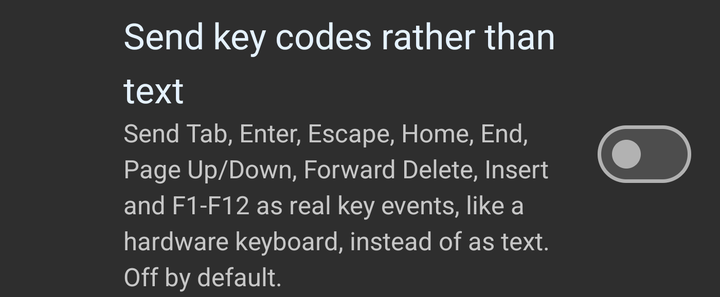

Toggle: Settings > Typing > Send key codes rather than text. Issue [#9](https://github.com/tpdi/tpdi-android-keyboard/issues/9), PR [#41](https://github.com/tpdi/tpdi-android-keyboard/pull/41).

### Shift cycles the case of the word the cursor is on

With the cursor in or next to a word, Shift selects it and cycles lower / Capitalized / UPPER in place (stock only did this for a selection).

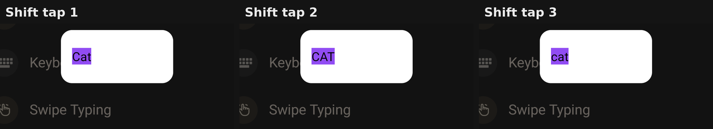

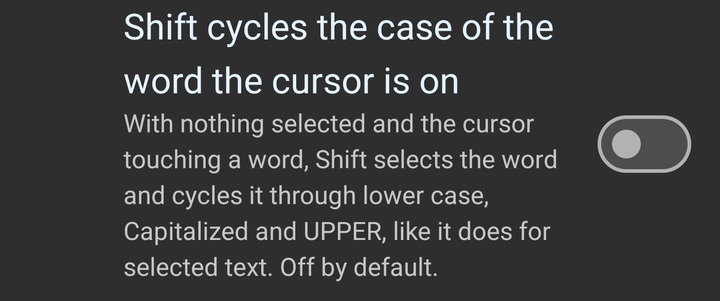

Toggle: Settings > Typing > Shift cycles the case of the word the cursor is on. Issue [#37](https://github.com/tpdi/tpdi-android-keyboard/issues/37), PR [#77](https://github.com/tpdi/tpdi-android-keyboard/pull/77).

### Shift suggests other cases of the word

Like Samsung's keyboard: Shift puts the Capitalized form of the touched word in the suggestion bar, the next tap UPPER.

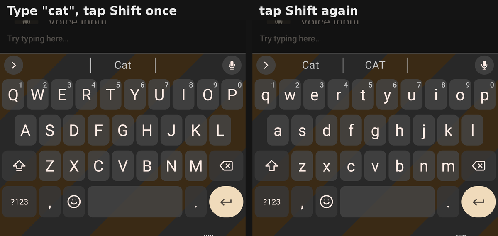

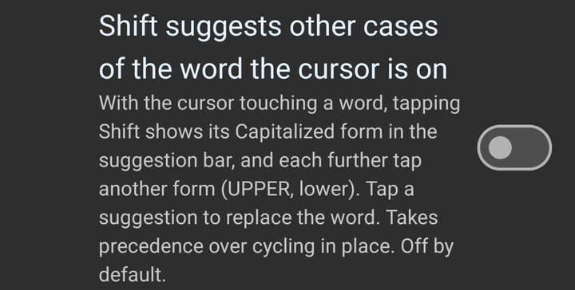

Toggle: Settings > Typing > Shift suggests other cases of the word the cursor is on. Issue [#38](https://github.com/tpdi/tpdi-android-keyboard/issues/38), PR [#78](https://github.com/tpdi/tpdi-android-keyboard/pull/78).

### Load layout from file

A Load from file button in the custom layout editor.

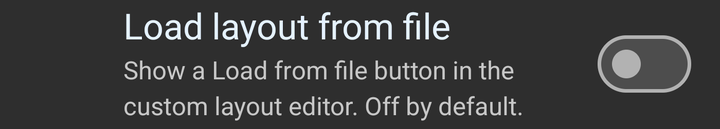

Toggle: Settings > Typing > Load layout from file. Issue [#7](https://github.com/tpdi/tpdi-android-keyboard/issues/7), PR [#70](https://github.com/tpdi/tpdi-android-keyboard/pull/70).

### Fourth alternate page

A layout key (key_to_alt_3_layout) that reaches a fourth alternate page.

Toggle: Layout opt-in: nothing changes unless a layout uses the key. Issue [#24](https://github.com/tpdi/tpdi-android-keyboard/issues/24), PR [#55](https://github.com/tpdi/tpdi-android-keyboard/pull/55).

### Dismiss-keyboard key

A layout action that hides the keyboard, like the chevron key on Samsung's keyboard.

Toggle: Layout opt-in: nothing changes unless a layout uses the key. Issue [#27](https://github.com/tpdi/tpdi-android-keyboard/issues/27), PR [#59](https://github.com/tpdi/tpdi-android-keyboard/pull/59).

### Show sensitive quick clips

Shows the quick-copy chip's text even when the app that copied it marked it sensitive.

Toggle: Settings > Clipboard. Issue [#29](https://github.com/tpdi/tpdi-android-keyboard/issues/29), PR [#62](https://github.com/tpdi/tpdi-android-keyboard/pull/62).

### Swipe typing after a long press (bug fix)

Swipe typing stopped working after using a long-press popup until the keyboard was reloaded.

Toggle: Bug fix, no setting. Issue [#26](https://github.com/tpdi/tpdi-android-keyboard/issues/26), PR [#57](https://github.com/tpdi/tpdi-android-keyboard/pull/57).

## Voice input

The voice toggles on Settings > Voice input. Every toggle is off by default. The hide-circle, hide-keyboard and mode-switch options only do anything while Dictate over the keyboard is on.

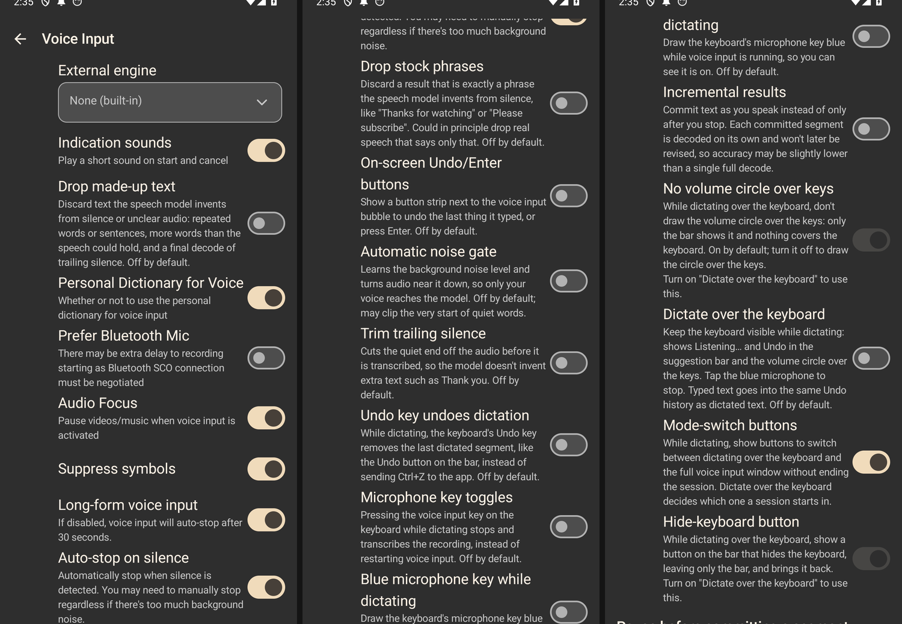

### Show words while listening

Shows the words recognized so far inside the voice bubble.

Toggle: Settings > Voice input > Show words while listening. Issue [#4](https://github.com/tpdi/tpdi-android-keyboard/issues/4), PR [#71](https://github.com/tpdi/tpdi-android-keyboard/pull/71).

### Incremental results

Commits speech segment by segment as you talk instead of only after you stop.

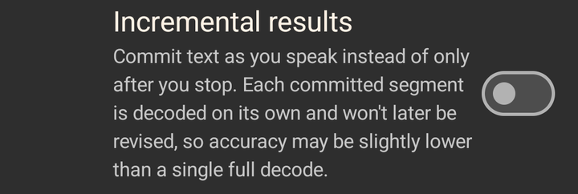

Toggle: Settings > Voice input > Incremental results. Issue [#10](https://github.com/tpdi/tpdi-android-keyboard/issues/10), PR [#72](https://github.com/tpdi/tpdi-android-keyboard/pull/72).

### Dictate over the keyboard

The keyboard stays visible while you dictate, with a Listening bar, Undo and a stop microphone, so you can type and talk in one session.

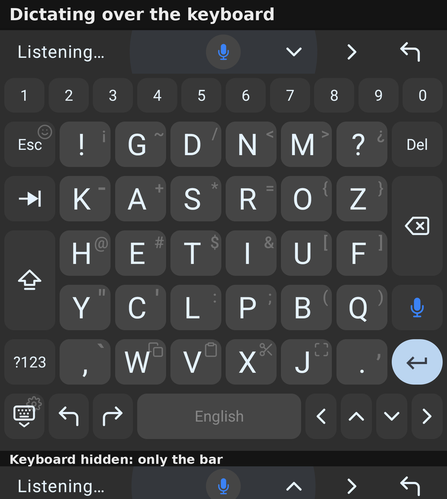

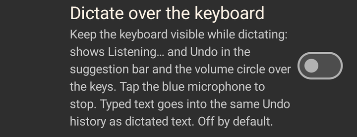

Toggle: Settings > Voice input. Issue [#13](https://github.com/tpdi/tpdi-android-keyboard/issues/13), PR [#48](https://github.com/tpdi/tpdi-android-keyboard/pull/48).

### Hide the volume circle over the keys

Draws only the bar part of the volume circle.

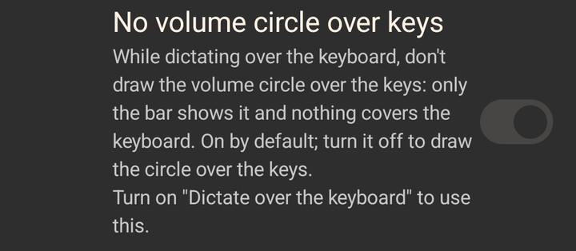

Toggle: Settings > Voice input. Issue [#21](https://github.com/tpdi/tpdi-android-keyboard/issues/21), PR [#52](https://github.com/tpdi/tpdi-android-keyboard/pull/52).

### Hide and show the keyboard while dictating

A chevron on the dictation bar collapses the keys and brings them back.

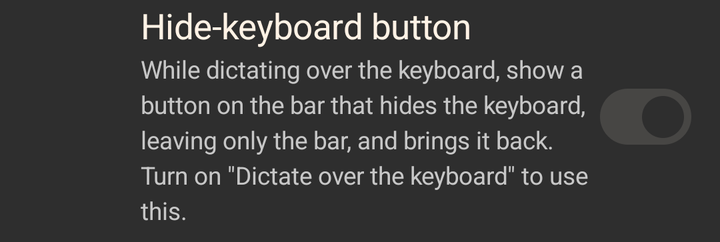

Toggle: Settings > Voice input. Issue [#22](https://github.com/tpdi/tpdi-android-keyboard/issues/22), PR [#53](https://github.com/tpdi/tpdi-android-keyboard/pull/53).

### Switch between dictation modes

Switch between dictating over the keyboard and the full voice window without ending the session.

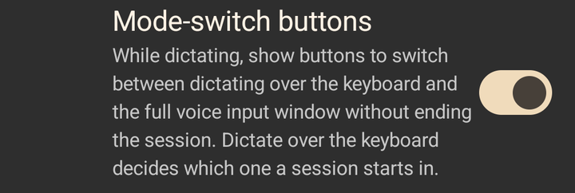

Toggle: Settings > Voice input. Issue [#23](https://github.com/tpdi/tpdi-android-keyboard/issues/23), PR [#54](https://github.com/tpdi/tpdi-android-keyboard/pull/54).

### Undo and Enter buttons

Undo the last dictated segment, or send Enter, from buttons in the voice window. Builds on the undo history (#11, PR #46).

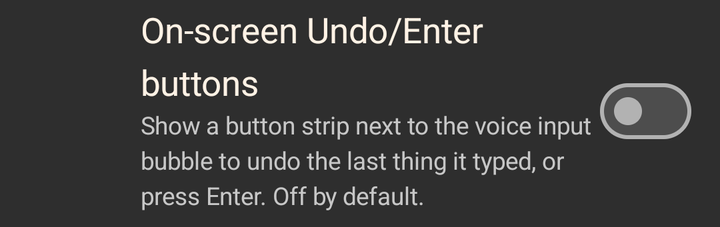

Toggle: Settings > Voice input > Action buttons. Issue [#12](https://github.com/tpdi/tpdi-android-keyboard/issues/12), PR [#47](https://github.com/tpdi/tpdi-android-keyboard/pull/47).

### Undo key undoes dictation

While dictating, the keyboard's Undo key removes the last dictated segment.

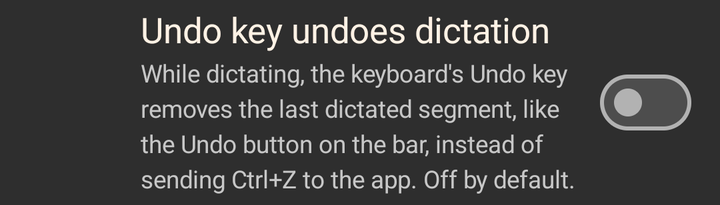

Toggle: Settings > Voice input. Issue [#32](https://github.com/tpdi/tpdi-android-keyboard/issues/32), PR [#66](https://github.com/tpdi/tpdi-android-keyboard/pull/66).

### Microphone key toggles

Pressing the voice input key again stops and transcribes the recording.

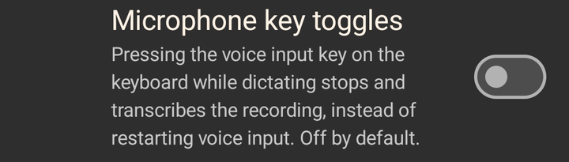

Toggle: Settings > Voice input. Issue [#31](https://github.com/tpdi/tpdi-android-keyboard/issues/31), PR [#65](https://github.com/tpdi/tpdi-android-keyboard/pull/65).

### Blue microphone key while dictating

The keyboard's microphone key turns blue while voice input is running.

Toggle: Settings > Voice input. Issue [#34](https://github.com/tpdi/tpdi-android-keyboard/issues/34), PR [#68](https://github.com/tpdi/tpdi-android-keyboard/pull/68).

### Click gestures

Click your tongue twice (the sound, not a finger tap) while dictating and the keyboard presses Enter.

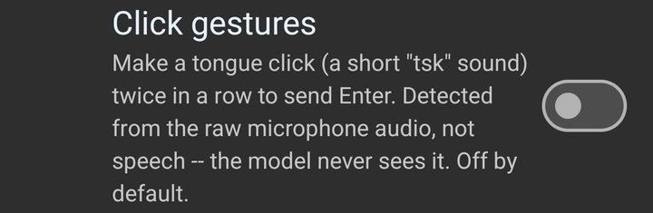

Toggle: Settings > Voice input. Issue [#15](https://github.com/tpdi/tpdi-android-keyboard/issues/15), PR [#45](https://github.com/tpdi/tpdi-android-keyboard/pull/45).

### Drop made-up text

Discards repeated loops and text the model invents from silence.

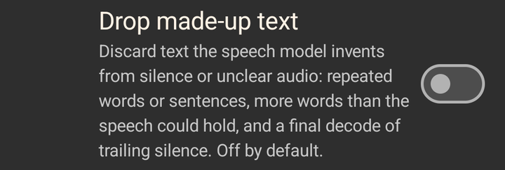

Toggle: Settings > Voice input > Drop made-up text. Issue [#16](https://github.com/tpdi/tpdi-android-keyboard/issues/16), PR [#44](https://github.com/tpdi/tpdi-android-keyboard/pull/44).

### Drop stock phrases

Discards results that are only phrases like "Thanks for watching".

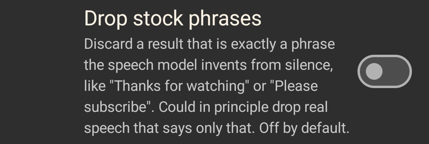

Toggle: Settings > Voice input. Issue [#20](https://github.com/tpdi/tpdi-android-keyboard/issues/20), PR [#51](https://github.com/tpdi/tpdi-android-keyboard/pull/51).

### Automatic noise gate

Learns the background noise level and turns audio near it down, so only your voice reaches the model.

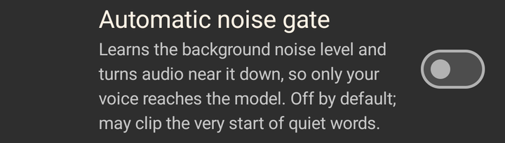

Toggle: Settings > Voice input. Issue [#28](https://github.com/tpdi/tpdi-android-keyboard/issues/28), PR [#61](https://github.com/tpdi/tpdi-android-keyboard/pull/61).

### Trim trailing silence

Cuts the quiet end off the audio before it is transcribed, so the model doesn't invent extra text.

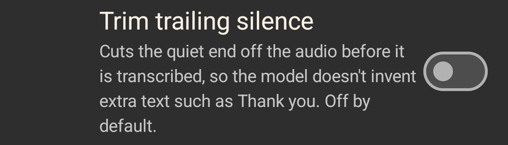

Toggle: Settings > Voice input. Issue [#30](https://github.com/tpdi/tpdi-android-keyboard/issues/30), PR [#63](https://github.com/tpdi/tpdi-android-keyboard/pull/63).
